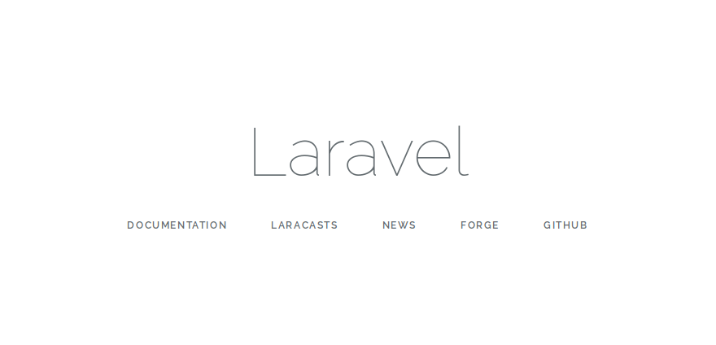

# Chapter 01: 라라벨 설치

## 새로운 라라벨 프로젝트 만들기
```
composer create-project laravel/laravel myapp --prefer-dist --verbose
```

라라벨 설치시 phpunit ext-dom 설치 요구시에는 다음처럼 대응한다. ([출처](https://stackoverflow.com/questions/43408604/php7-install-ext-dom-issue))
```
sudo apt install php7.2-xml
```


## 바로 실행해 보기
``artisan serve`` 명령어로 내장 웹서버를 돌릴 수 있지만, 이번에는 아파치를 이용해 돌린다.
아파치의 document root 디렉토리는 'myapp/public'으로 잡는다. 나머지 상세한 서버 셋업은 실습이므로 생략한다.

 
단, 이 상태로 바로 돌리면 APP_KEY 항목이 없어 에러가 난다.


설정이 빠져서 그런 건데, '.env.example' 파일을 복사해 '.env'로 만들자. 그리고 .env 파일의 항목을 적절히 수정하자.
몇몇 설정들은 나중에 수정해 줘도 되지만 'APP_KEY'는 가장 중요한 설정이므로 반드시 먼저 만들어 줘야 한다. 다음처럼 쉽게 키를 생성할 수 있다.
```
artisan key:generate
```

## 실습 결과
성공 화면.



* 가장 기초가 되는 라라벨로 된 프로젝트 생성법 숙지.
* 서버 셋업 (가장 기초로) 및 내장 서버로 결과 유도.
* 앱 키 설정, 최초 실행 결과 화면까지 유도.
